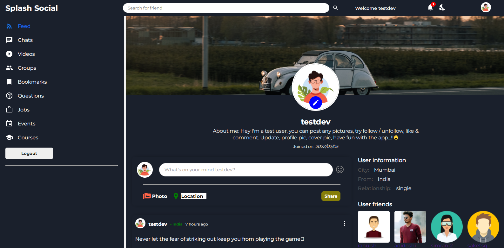

# Social Media MERN stack Application

## Tech Stack -

- React Js
- Context API (passing data throughtout the app) + use Reducer hook for application state management.
- Styling - Pure Vanilla CSS, MUI Icons

## Backend -

NodeJs + ExpressJs + MongoDB

[Repository](https://github.com/adidoshi/social-media_backend) | [Postman Doc](https://documenter.getpostman.com/view/15329989/UVeDuTTm)

---

## Core Functionalities -

### Light and Dark Theme mode:

- User can toggle between light and dark mode (by default light). Achieved by context API.

### User Authenication :

- Complete user authentication with JWT token and protected routes.
- Formik and YUP validation for register and login forms.

### Feed / Timeline :

- Home/ timeline screen wherein user followers post and self posts are displayed.
- When the post was created is available on each post.

### Share a post :

- User can share a post which get's updated in real time data. User can upload a picture which get's uploaded to cloudinary and that url get's stored in DB. User can add an emoji to its description. Also add a location by selecting from dropdown.

### User/ friend profile page -

- Posts of respective user and their information is visible on profile page. Also profile picture & cover picture is seen.

### Edit profile page -

- User can edit profile details like about me, city, username & upload profile picture, cover picture which get's uploaded to cloudinary.

### Follow/ Unfollow an user -

- When user follows another user, they can view that users posts on timeline & get's added to their following's list & vice versa.
- When unfollowed that user get's removed from the respctive user's followings's list.

### Like a post -

- Logged in user can like a post (count increases) (1 like per user), if a post is already like by the user, it can be disliked (the count reduces).
- Real time likes count is updated on the app.

### Comment on a post -

- Logged in user can post on a comment (only once), second time it get's edited.
- Comments for each post can be viewed at the bottom of the post card.

---

## Made with ❤️

by [adidoshi](https://github.com/adidoshi)
